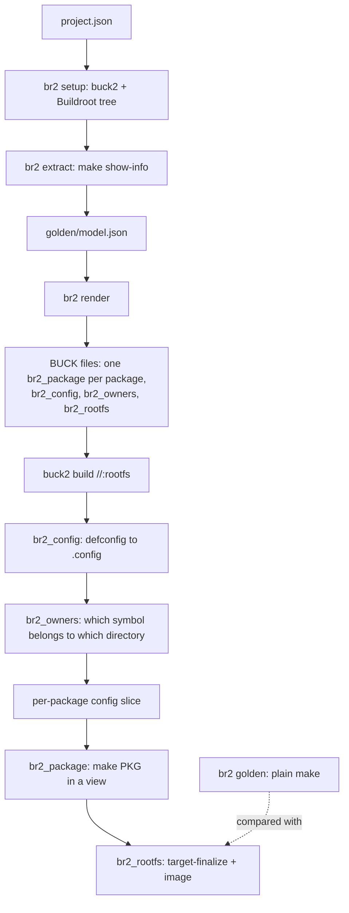

<title>Architecture</title>

# Architecture

buckroot is a code generator plus a set of Buck2 rules. It reads what Buildroot already
knows about a configured project, turns each package into a Buck2 target, and lets Buck2
schedule, cache and distribute them. Buildroot's own `.mk` logic is not rewritten
(for the `wrapped` variant it is not even bypassed): it runs inside Buck2 actions.

## From `project.json` to a root filesystem

1. **`br2 extract`** runs `make <defconfig>` and `make show-info` in a scratch output
   directory - no build - and stores the package graph in `golden/model.json`: each
   package's version, direct dependencies, source, hashes, patches, and the stamp
   directory Buildroot keeps its state in. Only the *graph* is extracted; build commands
   and hooks stay in Buildroot.
2. **`br2 render`** turns the model into `BUCK` files. Every package becomes a
   `br2_package` target in the directory where its Buildroot package lives, so the
   Buck2 target graph mirrors Buildroot's own layout.
3. **`buck2 build //:rootfs`** builds those targets in dependency order, in parallel.
   `br2_config` produces the `.config`; `br2_owners` scans every `Config.in*` to record
   which directory declares which symbol; each package gets a *slice* of the config.
4. **A package action** seeds a scratch Buildroot output directory with its config slice
   and its dependencies' outputs, then runs Buildroot's own `make <pkg>` in a mount
   namespace that shows it only what it declared. Its output is one tarball: the
   package's `per-package/<pkg>/{host,target}` tree, plus stamps.
5. **`br2_rootfs`** unpacks every package's artifact, merges the host and target trees the
   way Buildroot's `host-finalize` and `target-finalize` do, and runs the filesystem
   image step.

## The pieces

| Piece | Where | What it does |
|---|---|---|
| Rules | `toolkit/br2/rules.bzl` | `br2_package`, `br2_rootfs`, `br2_config`, `br2_owners`, the `br2_native_*` rules and their providers |
| Actions | `toolkit/br2/pkg_action.py` | what an action executes: seed, run `make` in the namespace, pack the delta |
| Namespace | `toolkit/scripts/br2-ns.sh` | fixed-path private mount namespace with allow-list views |
| Slicing | `toolkit/br2/slicing.py` | config ownership and the per-package slice |
| Generator | `toolkit/scripts/br2buck.py` | `extract`, `fetch`, `render` |
| CLI | `toolkit/scripts/br2` | setup, extract, golden, build, dev, matrix |
| Platform | `toolkit/platforms/`, `toolkit/br2/platform.bzl` | the execution platform with the remote switches |
| Backend | `toolkit/infra/buildbarn/` | cache, scheduler, worker, runner image, portal |

## Why a package rebuilds when it does

A package action's key is a hash of its command, its declared inputs and its declared
environment. Its declared inputs are:

- the **infrastructure** of the Buildroot tree (everything except other packages'
  directories),
- the **package directories** of the package and its dependency closure,
- the **config slice**, and
- the **outputs** of its dependencies.

Adding a package therefore changes: the new package's targets, the rootfs, and a few
tiny slice actions - not any existing package. Flipping a symbol owned by busybox
rebuilds busybox and the rootfs. Flipping a *global* symbol (optimization level,
architecture) rebuilds everything, because global symbols go to every slice - by design,
see [Views and config slices](views-and-slices.md).

Measured on a 30-package image with four cores: cold build 5 min 16 s; add an
upstream package 43 s (that package plus the rootfs); add an external package 40 s;
flip a busybox-only symbol 81 s (busybox and the rootfs); flip a global symbol 5 min 2 s
(everything).

## Where the results live

Buck2 decides whether an action reruns from its key, and stores the outputs in its
content-addressed store; with a remote cache configured it also uploads them to a
[Buildbarn](remote-cache-and-execution.md) cache, keyed the same way. Buildroot's own
output tree - the multi-gigabyte scratch space - lives in `~/.cache/br2/<project>` and
in per-action scratch directories, never inside the project.
