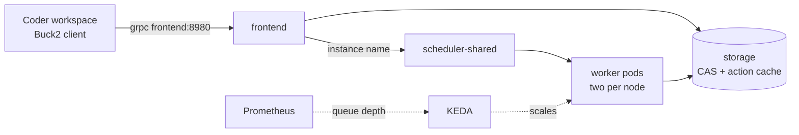

<title>Buildbarn and Coder on Kubernetes</title>

# Buildbarn and Coder on Kubernetes

A cluster dedicated to buckroot development, on Hetzner Cloud: Buildbarn (remote cache and remote execution) with autoscaled worker
pools, and Coder for workspaces. The code is in [`terraform/`](https://github.com/DeepSpaceCartel/buckroot/tree/main/terraform) and
[`charts/buckroot-buildbarn/`](https://github.com/DeepSpaceCartel/buckroot/tree/main/charts/buckroot-buildbarn). Reasoning: [ADR-0015](../decisions/0015-buildbarn-on-kubernetes.md).

!!! note "Applied"
    The cluster runs in Hillsboro since 2026-09-20. What the first apply found is in [What the first apply found](#what-the-first-apply-found).

## Why

On one 4-core machine a cold Car Thing build takes about 2 hours per cell, remote execution runs one action at a time, and the results matrix
takes about 8 hours. More capacity that exists only while builds run fixes both. The cheap way to get it is a cluster whose worker nodes are
created when actions are queued and deleted when they are not.

## What is deployed



| Node pool | Size | Runs |
|---|---|---|
| control | static x1, `cpx51` | the Talos control plane, and pods like any other node |
| nodes | 0 to 4, `cpx51` (16 vCPU, 32 GB) | everything: storage, frontend, scheduler, portal, Postgres, Coder and its workspaces, KEDA, Prometheus, Buildbarn workers |

Worker **pools** are schedulers plus workers, not node pools: `shared` (the default image) and `legacy` (a project's own baseline image, today FunKey-OS's: ubuntu:20.04 plus its SDK,
[ADR-0017](../decisions/0017-tool-baseline-per-project-era.md)); `dedicated` exists in the chart, switched off. Three workers share a node (9 GiB each, `make -j4`).

One pool, one server type, no taints: the project's server limit is 5, so a server that only one kind of pod may use is a wasted slot
([ADR-0016](../decisions/0016-one-node-pool.md)). The chart still supports a second, dedicated-CPU pool for clean timings (`pools.dedicated`), off until the limit is raised.

A **worker** is one pod with three containers: `bb-worker` (fetches inputs), the privileged `runner` (executes the command in the tool baseline image, starting
a mount namespace per action) and an idle reporter. Three workers share a node, each with a memory limit of 9 GiB: the build actions size `make -jN` from the container's memory (about 2 GiB per job), so a worker runs `make -j4` and cannot take another's memory. One action is one whole package build, so the worker count is the number of packages in flight; most packages are small, so more, narrower slots beat fewer wide ones. The Buildbarn configuration is the toolkit's,
unchanged: one `env.libsonnet` file holds every tunable, and the chart renders it from `values.yaml`.

## Choosing a pool

The client chooses by the **instance name** it uses (`br2 build --pool P` prefixes it with `P/`): an instance name starting with `dedicated/` goes to the
dedicated pool's scheduler when that pool is enabled, anything else to the shared pool. The cache is shared by all pools (Buildbarn's storage ignores instance names).

## How autoscaling works

Two layers.

1. **Pods.** KEDA scales each worker Deployment on the number of queued plus executing operations of its scheduler (a Prometheus query; the
   default is in the chart's `_helpers.tpl`). The scheduler exports no queue gauge, so the query is tasks scheduled minus tasks completed, which counts what is queued or running.
   It is on by default (`worker_autoscaling`); `worker_autoscaling = false` with `worker_replicas` holds a fixed count.
2. **Nodes.** A worker pod that cannot be scheduled makes the cluster autoscaler create a server in the matching pool; an empty node is removed a few minutes later.

The scheduler's platform queue is **predeclared** (`predeclaredPlatformQueues` in the scheduler config). A queue created by the first worker is removed again after the
*no workers* timeout (900 s here, 120 s in the Compose stack), and from then on an action fails at once (`No workers exist for instance name prefix ...`) instead of waiting:
KEDA then never sees demand and never scales up from zero. With the queue always present, an action waits while a node boots and the queue depth starts the worker
(measured: zero workers to a working worker in about 65 s on an existing node).

**Scale-in drains the worker first.** Removing a worker mid-action fails that action (Buck2 does not retry an infrastructure error), and a pod that is merely
sleeping before it stops is still handed new actions. So the `preStop` hook of all three containers (`files/drain.sh`) asks the scheduler to stop assigning to
this worker (the admin UI's `add_drain`), then waits until the scheduler no longer lists it as executing, for at most `workerDrainTimeoutSeconds` (an hour: the
pod's grace period is that plus a minute). Only then do the containers get SIGTERM; the idle reporter, PID 1 of its container, traps it, otherwise the pod would
linger until SIGKILL. bb-worker's image has no shell, so a static busybox is copied into the pod for the hooks. If the scheduler cannot be reached the hook falls
back to sleeping `workerTerminationDelaySeconds`. Idle workers are still preferred for removal: the reporter marks each pod busy or idle every 5 seconds (a non-empty
build directory means busy) through the `controller.kubernetes.io/pod-deletion-cost` annotation, and the ReplicaSet controller deletes the lowest-cost pods first.
The node autoscaler is told never to evict a worker pod (`safe-to-evict: "false"`); the node disappears after KEDA has removed the pod.

## Workspaces

Coder runs in the cluster, from its own Helm chart. The workspace template is Coder's stock Kubernetes example with the smallest changes: this cluster's namespace, bigger defaults (4 cores, 8 GB, a
100 GB home), the tools the example image lacks installed on start, and `BR2_RE_ENDPOINT=grpc://frontend.buildbarn.svc.cluster.local:8980`. Workspaces use the **remote modes only**; they need no privileged pod.

## Applying it

See [`terraform/README.md`](https://github.com/DeepSpaceCartel/buckroot/blob/main/terraform/README.md): apply `cluster`, check `kubectl get nodes`, apply `platform`, and clear the autoscaled nodes with
`platform/teardown.sh` before destroying. The worker image (`runner-image` workflow) has to be published and its digest set in `runner_image` first.

## Reaching it

Nothing is exposed to the internet. The [Tailscale Kubernetes operator](https://tailscale.com/kb/1236/kubernetes-operator) puts Coder on the tailnet
(`https://coder.<tailnet>.ts.net`, an Ingress of class `tailscale`, TLS from Tailscale); the tailnet policy that allows this is Terraform too
(`terraform/tailscale/`). `kubectl` on the machine that applied `cluster` works through `~/.kube/config`; from anywhere else, the plan is the
operator's API server proxy. The Buildbarn frontend is on the tailnet too, as a plain L4 proxy of the gRPC port: any tailnet machine builds with
`BR2_RE_ENDPOINT=grpc://buildbarn.<tailnet>.ts.net:8980` (a Service with the `tailscale.com/expose` annotation, `terraform/platform/tailscale.tf`).
The Buildbarn UIs are still `kubectl port-forward` (`svc/scheduler-shared 7982`, `svc/portal 8081`).

## Golden builds as Jobs

`br2 golden --k8s` runs a project's golden build as a Job in the worker image, so the golden and the remote builds share one tool baseline (the
class of difference found with OpenSSH's `xauth` cannot happen). The Job clones the repository at the pushed commit, fetches the source trees and
runs plain `make`; the manifest and timing come back through the pod log. Downloads land on a persistent volume (`golden-dl`, Buildroot's
`BR2_DL_DIR`, shared by all projects), so a second golden of any project downloads nothing and a retried Job continues where a rate-limited
download stopped. The volume is single-attach: one golden Job at a time.

A first golden of a project still downloads everything from the cluster's IP, and GitHub's codeload rate-limits that (429). A machine that has
already run `br2 fetch` holds the same files in `buildroot-src/dl`; seed the volume from it once, through a helper pod that mounts the claim:

```bash
kubectl -n buildbarn run golden-dl-seed --image=alpine:3.20 --restart=Never --overrides='{"spec":{"containers":[{"name":"seed","image":"alpine:3.20",
  "command":["sleep","7200"],"volumeMounts":[{"name":"dl","mountPath":"/dl"}]}],"volumes":[{"name":"dl","persistentVolumeClaim":{"claimName":"golden-dl"}}]}}'
tar -C experiments/<name>/buildroot-src/dl -cf - . | kubectl -n buildbarn exec -i golden-dl-seed -- tar -C /dl -xf -
kubectl -n buildbarn delete pod golden-dl-seed        # the Job cannot mount the claim while the helper holds it
```

### The download volumes (`golden-dl`, `golden-dl-b`, `golden-dl-c`)

A shared, persistent cache of Buildroot's downloads for anything that builds with plain `make` on the cluster (the golden Jobs, or any other Job).

| | |
|---|---|
| Objects | PersistentVolumeClaims in namespace `buildbarn`, defined in [`terraform/platform/golden.tf`](https://github.com/DeepSpaceCartel/buckroot/blob/main/terraform/platform/golden.tf) (`for_each` over the claim names; size `golden_dl_gib`, 60 Gi each) |
| Storage | Hetzner block volumes through the CSI driver, class `hcloud-volumes-encrypted` (the cluster default, encrypted, expandable online, reclaim policy `Delete`) |
| Access mode | `ReadWriteOnce`: **one node, therefore one pod, at a time per claim**. A second pod that mounts a claim in use stays `Pending` until the first ends. Several claims exist so several Jobs can run at once |
| Binding | `WaitForFirstConsumer`: the volume is created in the location of the first pod that uses it; a claim is `Pending` until then |
| Contents | Buildroot's `BR2_DL_DIR` layout: `/dl/<package>/<file>`, one directory per package, plus the toolchain tarballs. Files are versioned by name, so projects on different Buildroot versions coexist and Buildroot checks each hash itself |
| Use | mount at `/dl` and use it as the download directory: `make BR2_DL_DIR=/dl ...` or `ln -s /dl <buildroot>/dl` (what `br2 golden --k8s` does; `--dl-claim NAME` picks the claim) |

```yaml
volumes:
  - { name: dl, persistentVolumeClaim: { claimName: golden-dl-b } }
containers:
  - volumeMounts: [{ name: dl, mountPath: /dl }]
```

Rules of thumb: request the CPU and memory the build needs, not a whole node (one worker slot is 4.5 CPU and 9 GiB; the golden default is 7 CPU and 14 GiB), because the cluster is five servers in all and a Job whose request fits nowhere waits; check what holds a claim with
`kubectl -n buildbarn get pods -o json | jq -r '.items[] | select(.spec.volumes[]?.persistentVolumeClaim.claimName=="golden-dl") | .metadata.name'`.
To add a claim, add its name to the `for_each` in `golden.tf` and apply `terraform/platform` (a PVC-only change; it does not roll the Buildbarn pods). To preload a claim from a machine that already downloaded (a first golden of a project otherwise downloads from the cluster's IP, which GitHub rate-limits), see the seeding commands just above.

## What the first apply found

| Found | Fix |
|---|---|
| The runner and the worker share the pod's network namespace, so both bound the diagnostics port and the runner exited | the runner config has no diagnostics server |
| Prometheus's node-exporter needs host namespaces, which the namespace's baseline Pod Security level refuses; Helm waited for the whole timeout | node-exporter is off (nothing uses node metrics) |
| The image name had an uppercase organisation and the package was private | lowercase name; the package is public (the image holds only build tools) |
| A worker pod sized to a whole node, plus a pool per purpose, against a project limit of 5 servers | one untainted pool, two workers per node (ADR-0016) |
| `br2 setup` needs `zstd` for the buck2 download, which the worker image lacks | `br2 setup --no-buck2` in the golden Job (a golden build is plain make) |
| `br2buck.py render` was not deterministic (a symlink target inside nested carved packages had two owners, picked by set order) | the most specific owner wins; verified under eight hash seeds |

Verified: privileged worker pods run under Talos; a worker registers and executes actions (helloworld remote-cache, 61 of 61 actions remote, warm run 61 of 61 cached, manifest
IDENTICAL against a golden built by `br2 golden --k8s` in the same image); Car Thing's 98 packages pass `viewcheck --mode remote`. Not yet measured: cold-start time from zero
nodes, the KEDA query under a real build (it matched the busy workers when idle-checked, not yet under load), and a mid-build scale-in.

## Not done

Internal cluster security (network policies, RBAC hardening: single-tenant for now), the Buildbarn UIs and gRPC endpoint on the tailnet, `kubectl` from other
machines (the operator's API server proxy), and worker autoscaling from the scheduler's queue.
