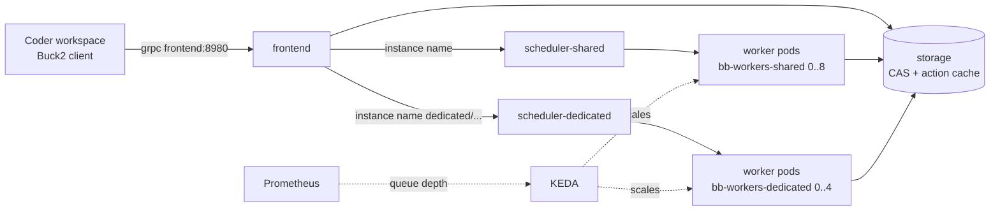

<title>Buildbarn and Coder on Kubernetes</title>

# Buildbarn and Coder on Kubernetes

A cluster dedicated to buckroot development, on Hetzner Cloud: Buildbarn (remote cache and remote execution) with autoscaled worker
pools, and Coder for workspaces. The code is in [`terraform/`](https://github.com/DeepSpaceCartel/buckroot/tree/main/terraform) and
[`charts/buckroot-buildbarn/`](https://github.com/DeepSpaceCartel/buckroot/tree/main/charts/buckroot-buildbarn). Reasoning: [ADR-0015](../decisions/0015-buildbarn-on-kubernetes.md).

!!! warning "Written and validated, not yet applied"
    Everything here passes `terraform validate`, `helm lint` and `helm template`, and the rendered Buildbarn configuration was accepted by the
    Buildbarn binaries. It has **not** been applied to a real Hetzner project. The first apply will find things; the risks are listed at the end.

## Why

On one 4-core machine a cold Car Thing build takes about 2 hours per cell, remote execution runs one action at a time, and the results matrix
takes about 8 hours. More capacity that exists only while builds run fixes both. The cheap way to get it is a cluster whose worker nodes are
created when actions are queued and deleted when they are not.

## What is deployed

| Node pool | Size | Runs |
|---|---|---|
| control | static x1 | Talos control plane |
| platform | static x1 | storage, frontend, schedulers, portal, Postgres, Coder, KEDA, Prometheus |
| bb-workers-shared | 0 to 8 | worker pods on cheap shared-vCPU servers |
| bb-workers-dedicated | 0 to 4 | worker pods on dedicated-vCPU servers, for measured runs |
| coder-workspaces | 0 to 2 | Coder workspace pods |

A **worker** is one pod with three containers: `bb-worker` (fetches inputs), the privileged `runner` (executes the command in the tool baseline image, starting
a mount namespace per action) and an idle reporter. One worker runs on one node, so `make -jN` sees the node's CPUs. The Buildbarn configuration is the toolkit's,
unchanged: one `env.libsonnet` file holds every tunable, and the chart renders it from `values.yaml`.

## Choosing a pool

Each pool has its own scheduler. The client chooses by the **instance name** it uses: an instance name starting with `dedicated/` goes to the dedicated pool, anything
else to the shared pool. The cache is shared by both (Buildbarn's storage ignores instance names). For measured runs use the dedicated pool for consistent timings.

## How autoscaling works

Two layers.

1. **Pods.** KEDA scales each worker Deployment on the number of queued plus executing operations of its scheduler (a Prometheus query, set per pool in
   `worker_scaling_queries`). Scaling is off until you provide the queries, because the scheduler's metric names have to be read from a running scheduler first.
2. **Nodes.** A worker pod that cannot be scheduled makes the cluster autoscaler create a server in the matching pool; an empty node is removed a few minutes later.

The scheduler's *no workers* timeout is 900 seconds here (120 s in the Compose stack): with workers at zero, an action waits in the queue while a node boots, and must not fail meanwhile.

**Scale-in does not wait for running actions.** Removing a worker mid-action fails that action (Buck2 does not retry an infrastructure error). So scale-in is arranged to pick an idle worker:
the idle reporter marks each pod busy or idle every 5 seconds (a non-empty build directory means busy) through the `controller.kubernetes.io/pod-deletion-cost` annotation, and the
ReplicaSet controller deletes the lowest-cost pods first. The node autoscaler is told never to evict a worker pod (`safe-to-evict: "false"`); the node disappears after KEDA has removed the pod.
A 60-second delay before a worker stops is insurance for the rare case. All of this needs verifying with a mid-build scale-in test (see the risks).

## Workspaces

Coder runs in the cluster, from its own Helm chart. The workspace template is Coder's stock Kubernetes example with the smallest changes: this cluster's node pool and namespace, bigger defaults (4 cores, 8 GB, a
100 GB home), the tools the example image lacks installed on start, and `BR2_RE_ENDPOINT=grpc://frontend.buildbarn.svc.cluster.local:8980`. Workspaces use the **remote modes only**; they need no privileged pod.

## Applying it

See [`terraform/README.md`](https://github.com/DeepSpaceCartel/buckroot/blob/main/terraform/README.md): apply `cluster`, check `kubectl get nodes`, apply `platform`, and clear the autoscaled nodes with
`platform/teardown.sh` before destroying. The worker image (`runner-image` workflow) has to be published and its digest set in `runner_image` first.

## Risks to check on the first apply

| Risk | How to check |
|---|---|
| The server types exist in Hillsboro and the project's server quota is high enough | `hcloud server-type list`; ask Hetzner for a higher limit before scaling |
| Privileged runner pods are admitted under Talos and the namespace exemption | a worker pod reaches `Running` |
| The idle reporter's file test matches how `bb-worker` lays out its build directory | watch the pod annotation change while an action runs |
| The scheduler metric for the KEDA query | read a scheduler's `/metrics` on port 9980 |
| Cold start: server creation, Talos boot, pulling the ~1 GB runner image | time from queued action to first running action; consider a warm minimum during work hours |
| A scale-in during a running build fails no action | remove capacity mid-build on purpose |
| Storage performance on network volumes | compare cache hit and upload rates with the single-machine stack |
| Mounting an `emptyDir` at `/config/gen` inside the ConfigMap mount | the worker pod starts and registers with the scheduler |

## Not done

A public gateway, TLS and DNS for Coder and the Buildbarn UIs (they are reached by `kubectl port-forward`), internal cluster security (network policies, RBAC hardening: single-tenant for now),
external access to Buildbarn with client authentication, and the golden build as a Kubernetes Job on the dedicated pool.
