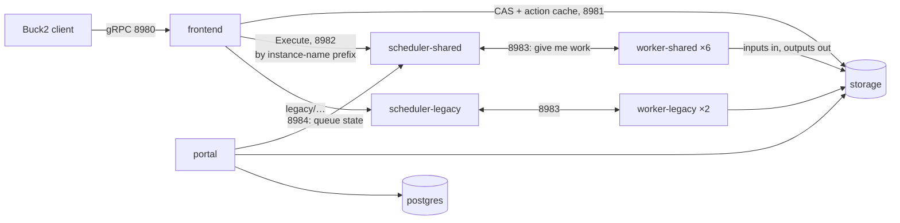

<title>Step 7: Buildbarn on Kubernetes</title>

# Step 7: Buildbarn on Kubernetes, piece by piece

[Step 2](buck2.md) ended with Buck2 sending an action *somewhere else* to be executed, and [Step 4](wrapped.md) showed that
somewhere else running `make hello` in a private room. This page is about the somewhere else. It takes the Buildbarn stack that
buckroot runs on its Kubernetes cluster apart, one program at a time, and follows a single action through it. It assumes you have
never used Buildbarn or Kubernetes; the Kubernetes words are explained where they appear, and everything printed here is real
output from the running cluster.

If you only want to *use* the cluster, the [Kubernetes guide](../guides/kubernetes.md) is shorter. If you want to know why it is
shaped this way, read [ADR-0015](../decisions/0015-buildbarn-on-kubernetes.md) and [ADR-0016](../decisions/0016-one-node-pool.md).

## What problem the stack solves

Buck2 on your machine has a graph of actions. For each one it can either run the command itself (**local execution**) or hand the
command, plus every input file, to a service that runs it elsewhere and hands back the outputs (**remote execution**). Either way it
can first ask a service "has anyone already run this exact action?" (a **remote cache**). The protocol for both is the
[Remote Execution API](https://github.com/bazelbuild/remote-apis), REAPI, and Buildbarn is one implementation of the server side.

REAPI has three services, and the whole stack is those three plus what they need:

| Service | What it stores or does | The Buildbarn program |
|---|---|---|
| **CAS**, content-addressable storage | every file, keyed by the SHA-256 of its content: inputs going in, outputs coming back | `bb-storage` |
| **Action cache** | "action X, with these inputs, produced these outputs", keyed by the action's digest | `bb-storage` (same program, a second store) |
| **Execution** | run this action on a machine that has the tools, tell me when it is done | `bb-scheduler` + `bb-worker` + `bb-runner` |

Everything else on the cluster (the frontend, the portal, Postgres) is plumbing or a window into the above.

## The pieces, as Kubernetes sees them

Kubernetes runs programs as **pods** (one or more containers that share a machine and a network address), grouped in a **namespace**.
Buildbarn lives in the namespace `buildbarn`. Listing its pods on the cluster:

```text
$ kubectl -n buildbarn get pods -o wide
NAME                                READY   STATUS    NODE
frontend-f688ff9c4-8ngvj            1/1     Running   nodes-6a168408f653ec1
frontend-f688ff9c4-kdkhz            1/1     Running   control-1
portal-85d5b95cf5-9g769             1/1     Running   control-1
postgres-0                          1/1     Running   control-1
scheduler-legacy-55dbc4d65f-hxx5p   1/1     Running   control-1
scheduler-shared-7547cf7569-m6p6q   1/1     Running   control-1
storage-0                           1/1     Running   control-1
worker-legacy-57cc765f59-97fkc      3/3     Running   nodes-6a168408f653ec1
worker-legacy-57cc765f59-qh26m      3/3     Running   nodes-1376132cbc3d183c
worker-shared-5b6dd8dff9-2bv88      3/3     Running   nodes-5aacc906933c2f8e
worker-shared-5b6dd8dff9-blxj6      3/3     Running   nodes-60057ce357a95585
worker-shared-5b6dd8dff9-h7vmn      3/3     Running   nodes-6a168408f653ec1
worker-shared-5b6dd8dff9-nf2cl      3/3     Running   nodes-1376132cbc3d183c
worker-shared-5b6dd8dff9-nzxdc      3/3     Running   nodes-5aacc906933c2f8e
worker-shared-5b6dd8dff9-p822g      3/3     Running   control-1
```

Seven kinds of pod. `READY 3/3` on a worker means three containers in one pod; the others are single-container pods. `NODE` is the
server the pod runs on: `control-1` is the static control node, `nodes-…` are servers the autoscaler created and will delete again
([ADR-0016](../decisions/0016-one-node-pool.md)).

Pods find each other through **Services**: a stable name and port in the cluster's DNS that points at whichever pods currently
have a given label. These are the addresses the Buildbarn programs are configured with:

```text
$ kubectl -n buildbarn get svc
NAME                 TYPE        PORT(S)
frontend             ClusterIP   8980/TCP
frontend-tailscale   ClusterIP   8980/TCP
portal               ClusterIP   8081/TCP,8082/TCP
postgres             ClusterIP   5432/TCP
scheduler-legacy     ClusterIP   8982/TCP,8983/TCP,8984/TCP,7982/TCP
scheduler-shared     ClusterIP   8982/TCP,8983/TCP,8984/TCP,7982/TCP
storage              ClusterIP   8981/TCP
```

`ClusterIP` means reachable only from inside the cluster. Nothing here has a public address; how you reach it from outside is at
the end of the page.

The picture of who talks to whom:



## Storage: the CAS and the action cache

`storage-0` runs `bb-storage`. Two stores, both **content-addressed**: you ask for a blob by its digest (`<sha256>:<size>`), and you
store a blob under the digest of its content, so the same file uploaded twice occupies one slot and a corrupted blob is detectable.

- The **CAS** holds files: source tarballs, the package outputs of every action (the `hello.tar` of Step 4), the merged trees,
  the images. It is the only place bytes ever go between the client and a worker.
- The **action cache** holds, per action digest, a small record: which outputs (by digest) that action produced, its exit code,
  stdout and stderr. A cache hit is this record; the outputs are then fetched from the CAS.

On disk each store is a fixed number of equally sized **blocks** in a file on a persistent volume, plus a key-location map (a hash
table from digest to block and offset). Blobs are written into the newest block; when it fills, the oldest block is recycled.
That gives two properties worth knowing:

1. **One blob has to fit in one block.** The block size is `size / (old + current + new + spare blocks)`: 100 GiB in 22 blocks gives
   4.5 GiB blocks. The Car Thing fonts source (965 MB) overflowed the original 16 GiB/38-block layout; that is why the size is a chart
   value (`storage.casSizeGiB`) rather than a constant.
2. **Eviction is by age, not by use**, in block-sized steps. A cold cell that uploads 3 GB pushes out the oldest 3 GB of somebody
   else's blobs, whether they were hot or not. Size the CAS for the working set of the cells you run together.

The volumes are Hetzner block volumes attached to the node (`hcloud-volumes-encrypted`), so `storage-0` can move to another node
and keep its data, but only one node can mount a volume at a time, which is why it is a **StatefulSet** of one replica and not a
Deployment:

```text
$ kubectl -n buildbarn get pvc
NAME              STATUS   CAPACITY   STORAGECLASS
ac-storage-0      Bound    10Gi       hcloud-volumes-encrypted
cas-storage-0     Bound    104Gi      hcloud-volumes-encrypted
data-postgres-0   Bound    10Gi       hcloud-volumes-encrypted
golden-dl         Bound    60Gi       hcloud-volumes-encrypted
```

(`golden-dl` is not Buildbarn's; it is the download cache of the golden Jobs, [Kubernetes guide](../guides/kubernetes.md#golden-builds-as-jobs).)

An action cache entry is only served if every blob it references is still in the CAS (`completenessChecking` in the configuration),
so an evicted output turns into a cache miss rather than a broken build. That check is why the action cache is small: it is an
index, the CAS is the data.

## The frontend: one address for the client

`bb-storage` again, with a different configuration (`frontend.jsonnet`), two replicas behind the Service `frontend:8980`. It is
the only thing a client talks to. It offers all three REAPI services on one port and forwards them:

- CAS and action cache calls go to `storage:8981`.
- `Execute` calls go to a **scheduler**, chosen by the **instance name** the client sends. An instance name is a free string every
  REAPI request carries; buckroot uses it as a namespace for cache entries (each measured cell has its own, see
  [ADR-0010](../decisions/0010-cache-salt-per-cell.md)). The frontend's routing table maps a *prefix* of that name to a scheduler:
  `legacy/…` to `scheduler-legacy`, everything else to `scheduler-shared`. `br2 build --pool P` sets the prefix, and a project that
  names a tool baseline gets it by default ([ADR-0017](../decisions/0017-tool-baseline-per-project-era.md)).

Why a separate program instead of letting clients talk to storage and schedulers directly? So that the client configuration is one
address, so that storage can be sharded or replaced behind it, and so that the routing by instance name lives in one place. The
`frontend-tailscale` Service is the same pods exposed on the tailnet for machines outside the cluster.

## The scheduler: a queue with a memory

`bb-scheduler`, one per pool: `scheduler-shared` and `scheduler-legacy`. Each has four ports:

| Port | Who connects | For |
|---|---|---|
| 8982 | the frontend | `Execute`: here is an action digest, run it |
| 8983 | workers | "I am a worker of platform P, give me work"; results come back the same way |
| 8984 | the portal | the queue's state, for the UI |
| 7982 | you, through a port-forward | a built-in web page of the same state |

An `Execute` request is an action digest. The scheduler reads the action from the CAS to learn its **platform** (REAPI's way of
saying "what kind of machine can run this": a list of name/value properties), puts it in the queue of that platform, and waits for a
worker of that platform to ask for work. buckroot's client does not fill in the platform (Buck2 leaves it empty), so the scheduler is
configured to stamp every action with one fixed platform (`static` in `scheduler.jsonnet`) and the workers register with the same
one. That is also why pools are chosen by instance-name prefix rather than by platform: the routing happens one step earlier, in
the frontend.

The queue is in memory. If the scheduler pod restarts, queued actions are lost and the client gets an error for them; a
running build does not survive a scheduler restart (we found this out by rolling the pods with a `terraform apply` mid-cell;
[guide](../guides/kubernetes.md#what-the-first-apply-found)). What the scheduler *does* remember across an action's life:

- Two identical `Execute` requests (same digest) are merged into one execution; Buck2 clients of two cells asking for the same
  action get the same result (`in-flight deduplication`, visible as a counter in its metrics).
- An action with no worker for its platform waits `noWorkersTimeout` (900 s here) before it fails, long enough for the autoscaler
  to create a server, boot it and pull the worker image.

The built-in page at port 7982 is the fastest way to see what a pool is doing:

```text
$ kubectl -n buildbarn port-forward svc/scheduler-shared 7982:7982 &
$ curl -s localhost:7982/ | sed 's/<[^>]*>/ /g' | tr -s ' \n' ' '
… Total number of operations: 3 … Queued operations … Workers: All 6, Executing 3, Idle 3 …
```

`Operations` are actions from the client's point of view (one per `Execute`); `Executing` and `Idle` count worker slots. A long
queue with idle workers would be a bug; a long queue with every worker executing is the pool being too small.

## The worker pod: three containers and a socket

`worker-shared-…` is where an action runs. One pod is one **slot**: it executes one action at a time (`concurrency: 1`), because in
buckroot one action is one whole package build, a `make -jN` that already fills a slot's CPUs and memory. Six such pods in the
shared pool, two in the legacy pool, three per server.

Inside the pod:

```text
$ kubectl -n buildbarn get pod worker-shared-5b6dd8dff9-2bv88 -o jsonpath='{.spec.initContainers[*].name} | {.spec.containers[*].name}'
runner-installer prepare | worker runner idle-reporter
```

Two **init containers** run to completion before the pod starts: `runner-installer` copies the `bb_runner` binary into a shared
volume (`/bb`), and `prepare` creates the build and cache directories and writes this pod's name into a small jsonnet file, so the
worker registers under a unique name (`slot`). Then three containers run side by side, sharing the volume `/worker`:

- **`worker`** (`bb-worker`) talks to the scheduler. When it gets an action it fetches the action's input tree from the CAS into a
  local cache (`/worker/cache`, 20 GiB, least-recently-used) and **hard-links** the files into a fresh build directory under
  `/worker/build`, so a second action needing the same 500 MB tarball costs a link, not a download. Then it asks the runner to
  execute the command, waits, uploads the declared outputs to the CAS, reports the result to the scheduler and deletes the build
  directory.
- **`runner`** (`bb-runner`) is the process that actually runs the command, in the **tool baseline image**
  (`buckroot-worker:latest`, or a project's own such as `:funkey`). The worker and the runner are separate programs on purpose:
  the worker has network access to the CAS and the scheduler, the runner has the compilers, and they meet on a Unix socket
  (`/worker/runner`) and a shared directory. The runner is the one container that is *privileged*, because every buckroot action
  starts a mount namespace to build at fixed paths (`scripts/br2-ns.sh`, [Step 4](wrapped.md)); that is why the whole namespace
  carries the `privileged` Pod Security label. Its memory **limit** (9 GiB) is what the action reads to choose `make -j4`.
- **`idle-reporter`** is a few lines of shell: every five seconds it looks at `/worker/build`, and if it is non-empty (an action is
  running) it sets the pod annotation `controller.kubernetes.io/pod-deletion-cost` to 1000, otherwise to 0. When the number of
  workers is reduced, Kubernetes deletes the pods with the *lowest* cost first, so scaling in removes idle workers and not one in
  the middle of `gcc`. Whether it reports exactly right is one of the things still being verified.

The build directory and `/var/tmp` are `emptyDir` volumes on the node's own disk: fast, and gone with the pod. Nothing on a worker
is state; a worker can be killed at any time and the only loss is the action it was running, which the client then reports as an
infrastructure error.

## Following one action through

Take the `hello` package of [Step 4](wrapped.md) built with `--mode remote`:

1. Buck2 computes the action: command line, environment, the input tree (the digests of every input file and directory), the
   platform. It hashes all of that into the **action digest**.
2. It asks the frontend's action cache for that digest. Miss (cold run).
3. It uploads to the CAS whatever the CAS says it is missing (`FindMissingBlobs` first, then only the missing bytes), then calls
   `Execute` with the digest and its instance name.
4. The frontend routes the call by the instance-name prefix to `scheduler-shared`, which queues the action for the fixed platform.
   Buck2 shows `re_queued`.
5. A worker's `bb-worker` polls the scheduler, gets the action, fetches the inputs into its cache, hard-links them into
   `/worker/build/<id>/`, and hands the command to the runner over the socket. Buck2 shows `re_execute`.
6. The runner starts the command: `python3 br2/pkg_action.py package …` with the declared inputs at their relative paths, which
   enters the mount namespace and runs `make hello` (Step 4).
7. The command exits; `bb-worker` uploads `hello.tar` to the CAS, writes the action-cache entry (outputs, exit code, stdout,
   stderr), tells the scheduler, deletes the build directory.
8. The scheduler completes the `Execute` call; Buck2 downloads `hello.tar` from the CAS (or, with `--materializations` deferred,
   only when something needs it locally).

Everything after step 1 is keyed by digests. That is what makes the cache safe to share between machines: a client on your
desktop and a client in a Coder workspace computing the same action digest get the same entry, provided they see the same
inputs, which is the whole subject of [views](../concepts/views-and-slices.md) and of the tool baseline.

`tools/buck2 log what-ran` prints each action's digest; pasting it into the portal shows the record above.

## The portal and Postgres

`bb-portal` is the web UI: browse the CAS (paste a digest, see the file or the directory tree), the action cache (an action's
command, inputs, outputs, stdout and stderr), and the schedulers' queues (it reads port 8984 of each). It also receives Buck2's
**build event stream** on port 8082, if a client is configured to send one, and stores what it receives in **Postgres**
(`postgres-0`, a StatefulSet with its own 10 GiB volume). Neither is needed for a build: the portal is for people, Postgres is
for the portal. Both are the successor of the older `bb-browser`, which the Compose stack used
([Buildbarn guide](../guides/buildbarn.md#web-uis)).

## Configuration: one file, two deployments

Every Buildbarn program takes one jsonnet file. buckroot keeps them in
[`toolkit/infra/buildbarn/config/`](https://github.com/DeepSpaceCartel/buckroot/tree/main/toolkit/infra/buildbarn/config): one per
program (`storage`, `frontend`, `scheduler`, `worker`, `runner`, `portal`) and one `env.libsonnet` with every tunable (addresses,
sizes, the routing table, the platform properties, the no-workers timeout). The Docker Compose stack of the
[Buildbarn guide](../guides/buildbarn.md) runs these files unchanged.

On Kubernetes the Helm chart mounts the same files into each pod from a **ConfigMap** (`bb-config-storage`, `bb-config-frontend`,
one per scheduler and per worker pool) and generates only `env.libsonnet` from `values.yaml`, so a pool's address, the CAS size or
a worker's concurrency are chart values and the program configurations do not fork. A change to any of these files rolls the pods
that use them (a checksum of the files is in the pod template), which is also why changing them during a build is a bad idea.

## Where the machines come from

None of the pods above is pinned to a server. The cluster has one static control node and one pool of identical servers that
Kubernetes' **cluster autoscaler** creates when a pod cannot be placed and deletes when a server has been empty for a few minutes.
Scaling the workers is therefore two numbers: the worker Deployment's replica count (today set by hand through
`worker_replicas`; the intended source is KEDA reading the scheduler's queue) and, following from it, the number of servers. The
cost of an idle cluster is the control node; the cost of a build is the servers it needed, by the hour.

## Reaching it

Nothing has a public address. From a Coder workspace on the cluster, `BR2_RE_ENDPOINT=grpc://frontend.buildbarn.svc.cluster.local:8980`
is set. From a machine on the tailnet, the same frontend is `grpc://buildbarn.<tailnet>.ts.net:8980` (a Tailscale proxy of the
Service). From the machine that applied the Terraform, `kubectl port-forward svc/frontend 8980:8980` gives `localhost:8980`, with
one catch that cost a cell: a port-forward keeps running but refuses connections once its pod has been replaced, so run it in a
restart loop. The UIs are port-forwards too: `svc/scheduler-shared 7982`, `svc/portal 8081`.

## What to try

- Build helloworld remotely and watch the scheduler page while it runs:
  `BR2_RE_ENDPOINT=grpc://localhost:8980 scripts/br2 build --variant wrapped --mode remote`.
- Run it again with `--mode remote-cache` twice: the second run shows `Commands: 61 (cached: 61 …)` and takes seconds; then find
  one of its actions in the portal.
- Look inside a worker while a build runs: `kubectl -n buildbarn exec <worker pod> -c runner -- ps -ef` shows the `make` of the
  package it is building; `ls /worker/build` in the `worker` container shows the action's directory appear and disappear.

That is the whole stack: two stores, a router, a queue and a room to run things in, and the rest is watching it.
