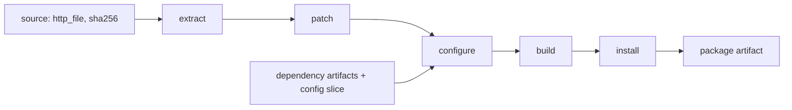
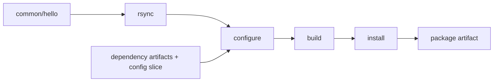

<title>Stepped</title>

# Stepped: one Buck2 action per Buildroot step

!!! warning "Design, not a feature"
    The stepped variant **does not exist yet**. There is no `stepped` mode in `br2`, no rule for it, and nothing on
    [Results](../project/results.md) measured with it. This page describes what it would be, and separates what
    was **checked by hand** on `helloworld` (real output below) from what is **a proposal**. It is here because it is the
    obvious middle between [wrapped](wrapped.md) and [native](native.md), and because deciding whether it is worth building
    needs the reasoning written down first.

## The idea

A wrapped action runs `make hello`, which is really several steps. Buildroot already knows them: every package has
step targets (`<pkg>-rsync` or `-download`/`-extract`/`-patch`, then `-configure`, `-build`, `-install-target`,
`-install-staging`, `-install-host`, `-install`), and records each finished step as a stamp file in
`build/<pkg>-<version>/`. Stepped makes each step its own Buck2 action, so Buck2 can cache and skip them separately,
while every step is still Buildroot's own code running in the same [namespace](wrapped.md#the-namespace).

## Checked by hand: the steps run separately

The wrapped action's `make hello` is not indivisible. This is the `hello` action's setup (seeded config, seeded
dependency trees, the same view and namespace), run one Buildroot step target at a time in the same output directory
(real output):

| Step target | Time | Stamps present afterwards |
|---|---|---|
| (seeded, nothing run) | - | none for `hello` |
| `hello-rsync` | 4.0 s | `.stamp_rsynced` |
| `hello-configure` | 2.4 s | + `.stamp_configured` |
| `hello-build` | 2.1 s | + `.stamp_built` |
| `hello-install-target` | 1.6 s | + `.stamp_target_installed` |
| `hello-install` | 1.6 s | + `.stamp_installed` |

Each step succeeded on its own, in order, and left exactly the stamp Buildroot's dependency logic looks for. That is the
property stepped relies on: **the stamps are a complete, inspectable record of progress**, and a later step needs nothing
from an earlier one except the build directory and those stamps.

Two things this experiment also shows. Every invocation pays a fixed cost of about 1.5 s (the namespace and `make`
parsing the tree): the last two steps do almost nothing else. `hello-rsync` is the slowest because `hello` is a `local`
package, so its "download" is copying a directory. And `hello-configure` (2.4 s) does no
configuring: `hello` has no configure script, so what runs is Buildroot's per-package merge of the four dependency
trees. A package with a real `./configure` would spend its time somewhere else.

## Proposed shape

For a package with a downloaded source, such as `host-e2fsprogs`, the graph would be:



and for `hello`, which has a `local` source:



Each step would be an action of the form `pkg_action.py step <name> --spec ... --in <previous>.tar --out <this>.tar`:
seed the output directory from the previous step's tar, run one Buildroot goal, pack the result. The final step's
artifact would be the same package artifact a wrapped build produces (the rootfs action could not tell them apart).

A rule for it could look like this. **This is an illustration of the interface, not existing code:**

```python
br2_stepped_package(
    name = "hello",
    pkg = "hello",
    steps = ["rsync", "configure", "build", "install"],     # the pipeline for this kind of package
    deps = [...],
    local_srcs = ["//common/hello:src"],
)
```

## What it would buy, and what it would not

Skipping only helps when a step's *inputs* did not change but a *later* step's did. Going through the cases:

| Change | Wrapped | Stepped | Gain |
|---|---|---|---|
| Edit `hello.c` | rerun `make hello` (12 s) | `rsync` output changes, so every step reruns | none |
| Edit a patch of a tarball package | extract, patch, configure, build, install | extract cached; patch onward | one extract |
| Change a config symbol that only affects the build flags | all steps | extract and patch cached | extract + patch |
| Same source and patches for a `host-` and a target package | two full builds | possible: one shared extract + patch, if that action is keyed on the archive and patches alone | one extract + patch |
| Edit an unrelated file of the tree | nothing (not in the view) | nothing | none |

So the gain is the `extract` and `patch` steps, and only when the source archive is large. For `gcc`, `linux` or `mesa3d`
extracting and patching is probably a few minutes of a build that takes an hour or more (not measured; that is step 1 of
[How to decide](#how-to-decide)); for `hello` it is nothing. Neither
`configure` nor `build` can be skipped in the common case, because they depend on everything before them.

## The cost

- **Data movement.** Every step's output has to be an artifact. After `extract` that is the whole source tree; after
  `build` it is the source tree *and* the objects. For the kernel that is gigabytes per step, uploaded to and downloaded
  from the cache, compared with one small tarball for a wrapped action. Stepped is only better where skipping saves
  more than moving the state costs.
- **Overhead per action.** Each step pays namespace start-up and seeding again (about 1.5 s for `hello`, more for a big
  closure). Five steps is five times the fixed cost.
- **Correctness surface.** Wrapped runs one `make` and Buildroot's own logic decides what is stale. Stepped splits that
  decision between Buildroot's stamps and Buck2's action keys; they must agree, and a step's action must not run against
  a stamp the previous action did not write.

## How to decide

Do not build it on principle. A measurement decides:

1. Take the two heaviest packages of the Car Thing (`host-gcc-final`, `linux`) and time `extract` and `patch` separately
   from the whole action.
2. Measure the size of the state after each step.
3. If extract + patch is more than roughly 5 % of the package's time *and* the state is small enough to move cheaply,
   prototype `br2_stepped_package` for those two packages only, behind the same `native`-style list in `project.json`.
4. Compare with the [results](../project/results.md) tables for the same cells.

If the answer is "no", the write-up is still useful: it says why wrapped is the right granularity for
Buildroot's own packages, and that finer skipping belongs to [native](native.md) rules, which skip *work*, not steps.

## Where it sits

| | Wrapped | Stepped | Native |
|---|---|---|---|
| Effort per package | none | none (generic) | a rule and a recipe |
| Buildroot's `.mk` runs | yes | yes | no |
| Skipped by Buck2 | package | step | job |
| Risk of divergence from Buildroot | none | low | real: verified per package |
