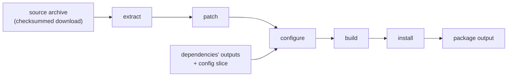
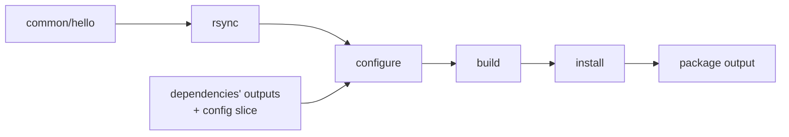

<title>Step 5: Stepped</title>

# Step 5: Stepped: one Buck2 action per Buildroot step

!!! warning "This is a design, not a feature"
    The stepped variant **does not exist yet**. There is no `stepped` mode in the `br2` command, no rule for it, and no row of
    the [Results](../project/results.md) tables measured with it. This page describes what it would be. It separates what was
    **checked by hand** on `helloworld` (real output below) from what is **a proposal**, and it ends with the measurement that would
    decide whether to build it. It is here because it is the natural middle between [wrapped](wrapped.md) and
    [native](native.md), and because writing the reasoning down comes before writing the code.

## Where we are, and the question

In [Step 4](wrapped.md) one Buck2 action ran the whole of `make hello`. Inside that one action, Buildroot did several distinct
things in order (recall the table in [Step 1](buildroot.md#the-life-of-a-package-the-steps)): get the source, configure,
build, install. Buck2 sees the action as a single black box: if any input changes, the whole box reruns, even when only the
last step needed to.

The question stepped asks: **what if each Buildroot step were its own Buck2 action?** Then Buck2 could cache and skip the
steps separately. Buildroot's own code would still do all the work; only the boundaries of the actions would move.

## Buildroot already has steps

Every Buildroot package can be built one step at a time. For `hello` (whose source is a local directory) the steps are
`hello-rsync`, `hello-configure`, `hello-build`, `hello-install-target` and `hello-install`. For a package with a downloaded
source the first steps are `-download`, `-extract` and `-patch` instead. And each finished step leaves a **stamp file** (the
empty marker files from [Step 1](buildroot.md#stamps-how-buildroot-knows-what-is-done)) in `build/<pkg>-<version>/`.

## Checked by hand: the steps really do run separately

To see whether stepping is even possible, I took the setup of the `hello` action from Step 4 (the seeded configuration slice, the
seeded dependency trees, the same view and private room) and ran the steps **one Buildroot step at a time** in the same output
directory. This is the real result:

| Step target run | Time | Stamps present afterwards |
|---|---|---|
| (seeded; nothing run yet) | - | none for `hello` |
| `hello-rsync` | 4.0 s | `.stamp_rsynced` |
| `hello-configure` | 2.4 s | `.stamp_rsynced`, `.stamp_configured` |
| `hello-build` | 2.1 s | ... `.stamp_built` |
| `hello-install-target` | 1.6 s | ... `.stamp_target_installed` |
| `hello-install` | 1.6 s | ... `.stamp_installed` |

Every step succeeded by itself, in order, and left exactly the one new stamp that Buildroot's dependency logic looks for. That is
the property stepped depends on: **the stamps are a complete and inspectable record of progress**, and a later step needs nothing
from the earlier ones except the build directory and those stamps.

Three things this small experiment also shows:

- **Every invocation pays a fixed cost of about 1.5 seconds** (entering the private room, `make` reading the makefiles). The
  last two steps do almost nothing else. Splitting a build into five actions pays that five times.
- `hello-rsync` is the slowest because `hello` is a `local` package, so its "download" is copying a directory.
- `hello-configure` (2.4 s) does no configuring. `hello` has no configure script; what runs is Buildroot's merge of the four
  dependency trees into the package's own (the `rsync` lines from Step 4's `make.log`). A package with a real `./configure`
  would spend its time there instead.

## What the design would look like

For a package with a downloaded source, such as `host-e2fsprogs`:



And for `hello`, whose source is a local directory:



Each box would be one action of the form:

```text
pkg_action.py step <name>  --spec <json>  --in <previous step's output>  --out <this step's output>
```

The action would seed a scratch output directory from the previous step's output, run **one** Buildroot goal in the same private
room as Step 4, and pack the result. The last step's output would be the same package archive a wrapped build produces, so the rest
of the system (the image step, other packages) could not tell the difference.

A rule for it might look like the following. **This is an illustration of what the interface could be, not existing code:**

```python
br2_stepped_package(
    name = "hello",
    pkg = "hello",
    steps = ["rsync", "configure", "build", "install"],     # the pipeline for this kind of package
    deps = [...],
    local_srcs = ["//common/hello:src"],
)
```

## What it would buy, and what it would not

Skipping helps only when a step's *inputs* did not change but a *later* step's did. Going through the cases:

| Change you make | Wrapped reruns | Stepped would rerun | Gain |
|---|---|---|---|
| Edit `hello.c` | all of `make hello` (12 s) | every step: the copied source changed, so everything after it differs | none |
| Edit a patch of a package with a downloaded source | download, extract, patch, configure, build, install | extract stays cached; patch onward | one extract |
| Change a config option that only affects build flags | everything | download, extract and patch stay cached | extract and patch |
| Two packages (say `host-foo` and `foo`) unpack the same archive and patches | two full builds | possibly one shared extract and patch, if that action is keyed on the archive and patches alone | one extract and patch |
| Edit an unrelated file in the tree | nothing (not in the view) | nothing | none |

So the gain is in the **download/extract/patch steps**, and only when the archive is big. For the compiler, the Linux kernel
or Mesa, extracting and patching is probably a few minutes of a build that takes an hour or more (I have not measured it; that
measurement is the first step of [How to decide](#how-to-decide) below). For `hello` it is nothing. `configure` and `build`
almost never skip, because they depend on everything before them.

## What it would cost

- **Data movement.** Each step's output is an artifact that Buck2 has to store and, in a cache or remote build, upload and
  download. After `extract` that is the whole source tree; after `build` it is the source tree *and* the compiled objects.
  For the Linux kernel that is gigabytes per step, against one small archive for a wrapped action. Stepped only wins where
  the work skipped is worth more than the cost of moving the data.
- **Fixed overhead per action.** The 1.5 seconds above, five times, plus seeding a larger scratch directory each time.
- **A bigger surface for mistakes.** In wrapped, Buildroot alone decides what is up to date (through stamps). In stepped that
  decision would be split between Buildroot's stamps and Buck2's action keys. They must agree, and a step's action must never
  run against a stamp the previous action did not write.

## How to decide

Do not build it on principle; measure first:

1. Take the two heaviest packages of the Car Thing project (`host-gcc-final` and `linux`) and time the extract and patch steps
   separately from the whole build.
2. Measure the size of the state (the build directory) after each step.
3. If extract plus patch is more than roughly 5% of the package's time **and** the state is small enough to move cheaply,
   prototype `br2_stepped_package` for those two packages only, selected through a list in `project.json` in the same way as
   the `native` list.
4. Run the prototype through the same eight-cell matrix and compare with the [results](../project/results.md).

If the answer is "no", writing it down still paid off: it explains why wrapped is the right granularity for Buildroot's own
packages, and why finer skipping belongs in [native rules](native.md), which skip *work* rather than steps.

## Where it sits

| | Wrapped | Stepped | Native |
|---|---|---|---|
| Effort per package | none | none (one generic rule) | a rule and a recipe, written by hand |
| Buildroot's makefile runs | yes | yes | no |
| Smallest unit Buck2 can skip | a package | a step | a job (compile, link, install) |
| Risk of differing from Buildroot's own result | none | low | real: checked package by package |

[Continue to Step 6: Native](native.md){ .md-button }
