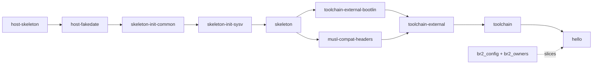

<title>Wrapped</title>

# Wrapped: `make hello` inside a Buck2 action

In the wrapped variant every Buildroot package is one Buck2 action, and that action runs Buildroot's own
`make <package>`. Buck2 decides *whether* and *when* to run it; Buildroot decides *how*. This page builds `hello` this
way and follows one action all the way down.

Start from the [overview](index.md), which covers `br2 setup`, `br2 extract` and `br2 golden`.

## Build one package

```bash
tools/buck2 build //buildroot-external/package/hello:hello --config br2.native= --show-full-output
```

```text
Commands: 22 (cached: 0, remote: 0, local: 22)
BUILD SUCCEEDED
root//buildroot-external/package/hello:hello  .../buildroot-external/package/hello/__hello__/hello.tar
real 1m12s
```

`--config br2.native=` sets the native list to empty, which is what makes it the wrapped variant. Buck2 ran 22
actions in 72 seconds. `buck2 log what-ran` lists them in the order they started:

| # | Category | What |
|---|---|---|
| 1 | `br2_owners` | `owners.json`: which config symbol is declared by which directory |
| 2 | `br2_config` | the `.config` for the defconfig |
| 3-12 | `br2_slice` | one config slice for each of the 10 packages below |
| 13-22 | `br2_package` | `host-skeleton`, `host-fakedate`, `skeleton-init-common`, `skeleton-init-sysv`, `skeleton`, `musl-compat-headers`, `toolchain-external-bootlin`, `toolchain-external`, `toolchain`, `hello` |

`hello`'s dependency closure is those ten packages, so those are the only ones built. The other 19 packages of the
image are not, because `hello` does not depend on them.



(Each package also depends on `host-skeleton` and `host-fakedate` directly; those edges are left out. `hello` itself depends on
`host-fakedate`, `host-skeleton`, `skeleton` and `toolchain`.)

## Anatomy of one action

Everything below is the `hello` action, `br2_package hello`.

### What Buck2 sees

`buck2 aquery --output-all-attributes //buildroot-external/package/hello:hello` prints the action Buck2 will run:

```text
category  br2_package
identifier hello
cmd       python3 buck-out/.../br2/__pkg_action__/pkg_action.py package
              --spec buck-out/.../hello/__hello__/package.spec.json
              --out  buck-out/.../hello/__hello__/output_artifacts/hello.tar
weight    1
executor_preference LocalRequired
allow_cache_upload  true
```

So an action is `pkg_action.py package --spec <json> --out <tar>`. Everything else - what to seed, what to show,
what to run - is in the spec, and the spec's contents are inputs of the action: change any of it and the action's cache
key changes. This is the (real) spec of the `hello` action, keys shortened:

```json
{
  "pkg": "hello",
  "stamp_dir": "build/hello-1.0",
  "dl_dir": "hello",
  "closure": [{"name": "host-skeleton", "tar": ".../host-skeleton.tar"}, {"name": "host-fakedate", "tar": "..."}, "..."],
  "direct": {"toolchain": ["host-skeleton", "host-fakedate", "skeleton-init-common", "..."], "skeleton": ["..."]},
  "dirs": ["buildroot-src/package/skeleton", "buildroot-src/package/fakedate", "...", "buildroot-src/toolchain/toolchain"],
  "infra_src": [".b4-config", "Config.in", "Makefile", "arch", "board", "...", "toolchain/toolchain.mk", "utils"],
  "infra_ext": ["external.desc", "external.mk"],
  "common_dirs": ["common/hello"],
  "common_src": {"hello": ["buck-out/.../common/hello/__src__/src"]},
  "slice": "buck-out/.../hello/__hello__/8c82fd7bcaacee98/hello.slice.tar",
  "symlinks": {"buildroot-src/system/skeleton/dev/fd": "../proc/self/fd", "...": "..."},
  "ns": "buck-out/.../scripts/__br2-ns.sh__/br2-ns.sh",
  "external": true
}
```

| Field | Meaning |
|---|---|
| `closure` | the artifacts (tarballs) of every package `hello` depends on, transitively, in build order |
| `direct` | each package's *direct* dependencies, which decides how Buildroot merges their trees |
| `dirs` | package directories of the closure: what the action may read of `buildroot-src/package/...` |
| `infra_src`, `infra_ext` | the rest of the Buildroot and external trees that is not a package directory |
| `common_dirs`, `common_src` | `hello`'s local source, as a declared Buck2 artifact |
| `slice` | this package's slice of the `.config` |
| `symlinks` | symlinks in the source tree that dangle, recorded as data (Buck2 cannot see them) |
| `ns` | the namespace script, as a declared artifact |

### The action's own scratch space

`pkg_action.py` works in `/var/tmp/buckroot-work/br2-hello-XXXXXXXX/` (`BR2_WORK_DIR`), outside the project because
Buildroot trees confuse Buck2's file watcher. It is deleted when the action ends; `BR2_KEEP_WORK=1` keeps it, which is
how the listings on this page were made. You can run any action by hand:

```bash
S=buck-out/v2/art/root/5fe249fa9992182d/buildroot-external/package/hello/__hello__/package.spec.json
BR2_KEEP_WORK=1 python3 br2/pkg_action.py package --spec $S --out /tmp/hello.tar
```

```text
[pkg_action] make hello
[pkg_action] kept /var/tmp/buckroot-work/br2-hello-cfwpklgt        (7 seconds)
```

```text
br2-hello-cfwpklgt/
  out/            the Buildroot output directory: .config, build/, per-package/, images/
  dl/hello/       downloads (none for hello)
  common-root/    the declared local sources, assembled
  overlay/        symlinks recreated from spec["symlinks"]
  view-src.txt    the allow-list for /mnt/src
  view-ext.txt    ... for /mnt/external
  view-common.txt ... for /mnt/common
  make.log        everything `make` printed
```

The action does four things, in this order.

**1. Seed the output directory** (`seed_config_and_stamps`). It unpacks the config slice into `out/.config` and
`out/build/buildroot-config/auto.conf`, and writes the *stamp files* of every package in the closure. A stamp is the
empty file `build/<pkg>-<version>/.stamp_installed` by which Buildroot's `make` knows a package is finished. With the
stamps present, `make hello` sees its dependencies as already built and does not try to build them.

**2. Rebuild the dependency trees** (`overlay_complete`). With per-package directories, Buildroot gives every package
its own `host/` and `target/` tree, built by merging the trees of its *direct* dependencies. A package's Buck2 artifact
holds only what it *added* (its delta), because complete trees each contain the whole 362 MB toolchain. So the action
rebuilds each direct dependency's complete tree by overlaying the deltas of that dependency's closure, in order, with
hard links (cheap).

**3. Run `make hello` in the namespace.** This is the only step that runs Buildroot.

**4. Pack the delta** (`pack_delta`): everything `make` created under `per-package/hello/` and `build/hello-1.0/` that
was not seeded, into one tar.

### The namespace

`make` does not run directly. It runs under `scripts/br2-ns.sh`, which enters a private mount namespace where
Buildroot's inputs are at **fixed absolute paths**:

| Path | Contents | Access |
|---|---|---|
| `/mnt/src` | the Buildroot tree, but only the entries in the *view* | read-only |
| `/mnt/external` | the external tree, view only | read-only |
| `/mnt/common` | the declared local sources | read-only |
| `/mnt/dl` | the download directory | read-write |
| `/mnt/out` | the output directory | read-write |

Two reasons. First, **Buildroot bakes absolute build paths into the image** (for example
`/usr/lib/libstdc++.so.6.0.32-gdb.py`); two checkouts at different paths would produce different filesystems and
different cache keys. Second, an action that cannot see or write something cannot depend on it silently. This is what the
namespace looks like from the inside, for the `hello` action (real output):

```text
$ ls -a /mnt
.  ..  common  dl  external  out  src
$ ls /mnt/src/package
Config.in  Config.in.host  Makefile.in  doc-asciidoc.mk  fakedate  musl-compat-headers
pkg-autotools.mk  pkg-cargo.mk  ...  pkg-waf.mk  skeleton  skeleton-init-common  skeleton-init-sysv
$ ls /mnt/src/package/busybox
ls: cannot access '/mnt/src/package/busybox': No such file or directory
$ touch /mnt/src/package/skeleton/x
touch: cannot touch '/mnt/src/package/skeleton/x': Read-only file system
$ ls -A /mnt/src/.git
ls: cannot access '/mnt/src/.git': No such file or directory
$ cat /proc/net/dev        # network namespace
    lo
$ ulimit -s ; echo $FORCE_UNSAFE_CONFIGURE
1048576
1
```

The `busybox` package exists in `buildroot-src/` on disk, but `hello` does not depend on it, so it is not in
`hello`'s view: **an undeclared read is `ENOENT`**, never a silently stale cache hit. `.git` is hidden so Buildroot's
version string does not depend on the state of a work tree. The network is off because every source is a declared input.
The stack limit and `FORCE_UNSAFE_CONFIGURE` are there for old Buildroot trees and for running as root.

### The view

The view is a list of paths. Its three parts, for `hello` (`scripts/show-inputs.py hello`):

```text
hello: closure = host-fakedate, host-skeleton, musl-compat-headers, skeleton, skeleton-init-common,
                 skeleton-init-sysv, toolchain, toolchain-external, toolchain-external-bootlin

== /mnt/src  (64 entries)       # the tree minus other packages' directories:
  .b4-config  Config.in  Makefile  arch/  board/  boot/  configs/  docs/  fs/  linux/  support/  system/  utils/
  package/Config.in  package/Makefile.in  package/pkg-autotools.mk  package/pkg-cmake.mk  ...  package/pkg-waf.mk
  package/fakedate/  package/musl-compat-headers/  package/skeleton/  package/skeleton-init-common/  ...
  toolchain/toolchain/  toolchain/toolchain-external/  toolchain/toolchain-buildroot/  toolchain/toolchain.mk
== /mnt/external  (3 entries)
  external.desc  external.mk  package/hello/
== /mnt/common  (1 entries)
  hello/
```

Buildroot's top-level makefile does `include $(sort $(wildcard package/*/*.mk))`, so a package directory that is
not in the view is simply not included - `make` parses fine with 64 entries instead of the whole tree. And the same list
is what Buck2 is told are the action's inputs, so the enforced view and the declared inputs cannot drift apart.

### The config slice

`hello`'s slice is **245 of the `.config`'s 4130 lines**. It keeps the global settings (architecture, toolchain, system,
filesystem options), the settings owned by the directories in `hello`'s view, the settings its own `.mk` mentions, and a few
that infrastructure makefiles read. It drops the rest: there is no `BR2_PACKAGE_BUSYBOX_...` line, because
busybox is not in the view. The slice starts like this:

```text
BR2_HAVE_DOT_CONFIG=y
BR2_EXTERNAL_NAMES="BUCKROOT_HELLOWORLD"
BR2_EXTERNAL_BUCKROOT_HELLOWORLD_PATH="/mnt/external"
BR2_HOST_GCC_AT_LEAST_4_9=y
...
BR2_aarch64=y
BR2_ARCH="aarch64"
BR2_GCC_TARGET_CPU="cortex-a53"
BR2_TOOLCHAIN_EXTERNAL=y
BR2_TOOLCHAIN_EXTERNAL_BOOTLIN=y
BR2_TOOLCHAIN_EXTERNAL_BOOTLIN_AARCH64_MUSL_STABLE=y
```

The slice is a deterministic tar (sorted, fixed timestamps), so an unchanged slice has an unchanged digest, and Buck2
stops the invalidation there ("early cutoff"): flipping a busybox option reruns the slice actions of all packages, but
`hello`'s slice comes out identical, so `hello` does not rebuild. See
[Views and config slices](../concepts/views-and-slices.md).

### What `make` does

`make.log` from the real run, trimmed of noise:

```text
make: Entering directory '/mnt/src'
>>> hello 1.0 Syncing from source dir /mnt/external/../common/hello
rsync -au --chmod=u=rwX,go=rX --exclude .svn --exclude .git ... /mnt/external/../common/hello/ /mnt/out/build/hello-1.0
>>> hello 1.0 Configuring
mkdir -p /mnt/out/per-package/hello/host
rsync -a --hard-links --link-dest=.../per-package/host-fakedate/host/ .../host-fakedate/host/ /mnt/out/per-package/hello/host
rsync -a --hard-links --link-dest=.../per-package/host-skeleton/host/ ...
rsync -a --hard-links --link-dest=.../per-package/skeleton/host/ ...
rsync -a --hard-links --link-dest=.../per-package/toolchain/host/ ...
mkdir -p /mnt/out/per-package/hello/target
rsync ... (the same four, for target/)
>>> hello 1.0 Building
/mnt/out/per-package/hello/host/bin/aarch64-linux-gcc -D_LARGEFILE_SOURCE -D_LARGEFILE64_SOURCE -D_FILE_OFFSET_BITS=64 -O2 -g0
    -o /mnt/out/build/hello-1.0/hello /mnt/out/build/hello-1.0/hello.c
>>> hello 1.0 Installing to target
/usr/bin/install -D -m 0755 /mnt/out/build/hello-1.0/hello /mnt/out/per-package/hello/target/usr/bin/hello
make: Leaving directory '/mnt/src'
```

Read it against `hello.mk`:

- **Syncing** is the `local` site method: copy `common/hello` into the build directory.
- **Configuring** is where Buildroot's per-package directories happen: `hello`'s own `host/` and `target/` are
  created by merging its four direct dependencies' trees. (`hello` has no configure script; the merge *is* its configure
  step.)
- **Building** runs `HELLO_BUILD_CMDS` - `$(TARGET_CC) $(TARGET_CFLAGS) -o hello hello.c` - with the compiler that is in
  the merged `host/bin`. `$(TARGET_CFLAGS)` expanded to `-D_LARGEFILE_SOURCE -D_LARGEFILE64_SOURCE -D_FILE_OFFSET_BITS=64
  -O2 -g0`.
- **Installing to target** runs `HELLO_INSTALL_TARGET_CMDS`.

### The artifact

The output, `hello.tar`, has twelve files (plus directories):

```text
per-package/hello/target/usr/bin/hello                                       the program (8392 bytes)
per-package/hello/host/aarch64-buildroot-linux-musl/sysroot/usr/share/buildroot/gdbinit
per-package/hello/host/aarch64-buildroot-linux-musl/sysroot/usr/lib/libstdc++.so.6.0.32-gdb.py
build/hello-1.0/.stamp_rsynced   .stamp_configured   .stamp_built   .stamp_target_installed   .stamp_installed
build/hello-1.0/.files-list.txt          (22 bytes: what hello installed)
build/hello-1.0/.files-list-host.txt   .files-list-staging.txt   .files-list-images.txt     (empty)
```

The stamps are what the *next* package's action seeds to convince `make` that `hello` is done; the `.files-list*`
files are Buildroot's record of what the package installed. The two sysroot files are rewritten by Buildroot for
every package that depends on the toolchain (with paths into that package's own tree); they are harmless and the
native variant does not reproduce them.

Downstream, `br2_rootfs` unpacks this tar as `hello`'s share of the image.

## The rest of the build

`//:rootfs` adds the other 19 packages (BusyBox, e2fsprogs, util-linux, the host tools) and one more action,
`br2_rootfs`, which unpacks every artifact, runs Buildroot's `host-finalize` and `target-finalize`, and builds the image
(`rootfs.ext4`). 61 actions in total. Its result is compared with the golden manifest:

```bash
scripts/br2 build --variant wrapped --mode local
```

```json
{"variant": "wrapped", "mode": "local",
 "cold": {"ok": true, "seconds": 338.0, "commands": 61, "cached": 0, "remote": 0, "local": 61, "manifest": "IDENTICAL"}}
```

## What reruns when something changes

Edit `hello.c` - a comment only - and build again:

```text
$ tools/buck2 build //buildroot-external/package/hello:hello --config br2.native=
Commands: 1 (cached: 0, remote: 0, local: 1)          real 12.4 s
  root//buildroot-external/package/hello:hello (br2_package hello)
```

One action reran: `hello` itself, 12 seconds (the same action run by hand takes 7: seeding the trees, `make`, packing). The ten `br2_slice`
actions and the nine dependency packages did not, because none of their inputs changed. The rootfs would rerun, and
the image with it. That is the wrapped granularity: **a package is the smallest unit Buck2 can skip**. If `hello`
were `linux`, the same one-line edit would rerun the kernel build.

## Cache and remote execution

The same action can run somewhere else. With `--config br2.remote_execution=true` Buck2 uploads the action's input
tree (the closure artifacts, the view entries, the spec, the scripts) to Buildbarn and a worker runs the identical
command; with `br2.remote_cache=true` it looks the action key up first. `pkg_action.py` needs nothing but its declared
inputs and the tool baseline in the worker image, which is what the fixed paths, the view and the empty environment
guarantee. Measured on this project, wrapped:

| Mode | Cold | Warm |
|---|---|---|
| local | 338 s | - |
| local-cache | 364 s | 8.5 s (61 of 61 from cache) |
| remote | 363 s | - |
| remote-cache | 417 s | 9.0 s (61 of 61) |

See [Remote cache and execution](../concepts/remote-cache-and-execution.md) for what breaks and why.

## What wrapped cannot do

- Skip inside a package. One changed input reruns the whole `make`, including the parts that did not need it.
- Guarantee anything about the host tools `make` calls (`gcc`, `perl`, `rsync`): they are not in the cache key.
  Remote execution pins them in the worker image; local runs use whatever is installed.

The [stepped](stepped.md) and [native](native.md) pages take the first of these on.
