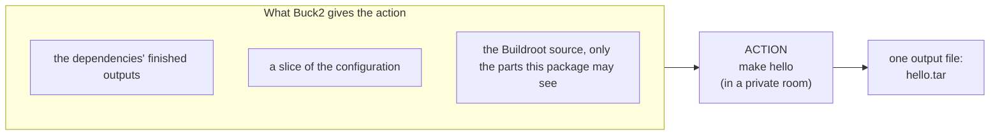
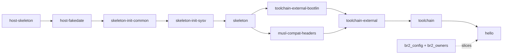

<title>Step 4: Wrapped</title>

# Step 4: Wrapped: `make hello` inside a Buck2 action

You now know what Buildroot builds ([Step 1](buildroot.md)), how Buck2 decides what to run ([Step 2](buck2.md)), and how
buckroot turns a Buildroot project into a graph of Buck2 targets ([Step 3](project.md)). This page answers the remaining
question for the first of three variants: **what actually runs when Buck2 builds the target for `hello`?**

In the **wrapped** variant the answer is: Buildroot's own `make hello`. buckroot *wraps* Buildroot's build of a package in a
Buck2 action. Buck2 decides whether and when to run it; Buildroot still decides how. This is the variant that works for
every package of every project, and the one all the results tables use as the baseline.

## The idea in one picture



An action is a function: inputs in, one output file out. The output, `hello.tar`, holds everything `make hello` produced
for this package. The rest of this page opens the box.

## Try it: build one package

From `experiments/helloworld`:

```bash
tools/buck2 build //buildroot-external/package/hello:hello --config br2.native= --show-full-output
```

`--config br2.native=` sets the list of native packages to empty, which is what makes it the wrapped variant.

```text
Commands: 22 (cached: 0, remote: 0, local: 22)
BUILD SUCCEEDED
root//buildroot-external/package/hello:hello  .../buildroot-external/package/hello/__hello__/hello.tar
```

Buck2 ran 22 actions (72 seconds in one measurement on a 4-core machine, longer when the machine is busy with something else). Why 22 if we asked for one target? Because `hello`
needs other things first, and those need things. `buck2 log what-ran` lists them:

| Count | Kind of action | What it does |
|---|---|---|
| 1 | `br2_owners` | reads every `Config.in` in Buildroot and records which config option belongs to which package |
| 1 | `br2_config` | turns the defconfig into the full `.config` |
| 10 | `br2_slice` | cuts a per-package slice out of the `.config` (explained below) |
| 10 | `br2_package` | runs `make <package>` for each of the ten packages `hello` needs, `hello` last |

The ten packages are `hello`'s **dependency closure**: `hello` plus everything it needs directly or indirectly. The other
19 packages of the image (BusyBox, the filesystem tools) are *not* built, because `hello` does not need them. This is one
of the differences from Buildroot: ask Buck2 for one target and you get only its closure.



(Every package also depends on `host-skeleton` and `host-fakedate` directly; those edges are left out. `hello` itself
depends on `host-fakedate`, `host-skeleton`, `skeleton` and `toolchain`.) The packages named `skeleton*` create the empty
directory layout of the filesystem; `toolchain*` unpack the prebuilt cross-compiler.

## Opening the box: one action

Everything below is the action `br2_package hello`. Three questions: what does Buck2 think it is, what does it do inside,
and how is it kept honest.

### What Buck2 sees

```bash
tools/buck2 aquery --output-all-attributes //buildroot-external/package/hello:hello
```

```text
category   br2_package
identifier hello
cmd        python3 buck-out/.../br2/__pkg_action__/pkg_action.py package
               --spec buck-out/.../hello/__hello__/package.spec.json
               --out  buck-out/.../hello/__hello__/output_artifacts/hello.tar
weight     1
allow_cache_upload true
```

The action is one command: run the Python script `pkg_action.py`, in "package" mode, giving it a **spec** and asking it to
write `hello.tar`. The spec is a JSON file: a plain-text description of the job, written by Buck2 from the target's
attributes. **Everything the script needs to know is in the spec**, and the spec's *contents* are inputs of the action. Change
any of it, and the action's key changes. This is the real spec for `hello`, with long lists shortened:

```json
{
  "pkg": "hello",
  "stamp_dir": "build/hello-1.0",
  "dl_dir": "hello",
  "closure": [{"name": "host-skeleton", "tar": ".../host-skeleton.tar"}, {"name": "host-fakedate", "tar": "..."}, "..."],
  "direct": {"toolchain": ["host-skeleton", "host-fakedate", "skeleton-init-common", "..."], "skeleton": ["..."]},
  "dirs": ["buildroot-src/package/skeleton", "buildroot-src/package/fakedate", "...", "buildroot-src/toolchain/toolchain"],
  "infra_src": [".b4-config", "Config.in", "Makefile", "arch", "board", "...", "toolchain/toolchain.mk", "utils"],
  "infra_ext": ["external.desc", "external.mk"],
  "common_dirs": ["common/hello"],
  "common_src": {"hello": ["buck-out/.../common/hello/__src__/src"]},
  "slice": "buck-out/.../hello/__hello__/8c82fd7bcaacee98/hello.slice.tar",
  "symlinks": {"buildroot-src/system/skeleton/dev/fd": "../proc/self/fd", "...": "..."},
  "ns": "buck-out/.../scripts/__br2-ns.sh__/br2-ns.sh",
  "external": true
}
```

| Field | What it means |
|---|---|
| `closure` | the **output files of every package `hello` needs** (each a `.tar`, i.e. an archive of files), in build order: the dependencies' results |
| `direct` | each package's *direct* dependencies. Buildroot merges only those, so the action must know them |
| `dirs` | the directories of those packages in the Buildroot tree (their makefiles and patches): what the action is allowed to read |
| `infra_src`, `infra_ext` | the rest of the Buildroot tree that is not a package directory: the core makefiles, the architecture files, and so on |
| `common_dirs`, `common_src` | `hello`'s own source, as a declared input |
| `slice` | this package's slice of the configuration (below) |
| `symlinks` | some symbolic links in the source tree point nowhere. Buck2 cannot see those files, so they are recorded here as data and recreated |
| `ns` | the script that creates the private room (below) |

### The private room: a "namespace"

The action does not run `make` directly. It runs it inside a **private mount namespace**. In plain terms: Linux can give a
process its own private view of the filesystem. The process sees a folder tree we construct for it; changes it makes do not
leak to the rest of the machine, and it sees nothing we did not put there. The script `scripts/br2-ns.sh` builds this room.
Inside, Buildroot's inputs are always at the **same fixed paths**, whatever your checkout path is:

| Path | Contents | Can the build write here? |
|---|---|---|
| `/mnt/src` | the Buildroot source, but only the parts this package is allowed to see | no (read-only) |
| `/mnt/external` | the BR2_EXTERNAL tree (`hello`'s own package), same rule | no |
| `/mnt/common` | `hello`'s source code | no |
| `/mnt/dl` | the download directory | yes |
| `/mnt/out` | the Buildroot output directory | yes |

Why go to this trouble? Two reasons.

**Reason 1: the paths get baked into the output.** Buildroot builds embed their build paths in the files they produce. For
example, the toolchain's helper file `usr/lib/libstdc++.so.6.0.32-gdb.py` contains the absolute path of the directory it was
built in. If you check out the project at `/home/anna/work` and your colleague at `/srv/ci/build42`, the two images would
differ, and Buck2 would see two different results for the same inputs; a cache would never hit across machines. With the room,
every build runs at `/mnt/...`, so the results are identical everywhere.

**Reason 2: it enforces honesty.** Remember from [Step 2](buck2.md): Buck2 can only be correct if an action reads *only* its
declared inputs. Buck2 does not stop a local action from reading other files, though. The room does. This is what the
`hello` action's room looks like (real output):

```text
$ ls /mnt/src/package                     # what hello may read of Buildroot's package directory
Config.in  Config.in.host  Makefile.in  doc-asciidoc.mk  fakedate  musl-compat-headers
pkg-autotools.mk  pkg-cargo.mk  ...  pkg-waf.mk  skeleton  skeleton-init-common  skeleton-init-sysv

$ ls /mnt/src/package/busybox             # BusyBox exists on disk, but hello does not depend on it
ls: cannot access '/mnt/src/package/busybox': No such file or directory

$ touch /mnt/src/package/skeleton/x       # writing into the source
touch: cannot touch '/mnt/src/package/skeleton/x': Read-only file system

$ ls -A /mnt/src/.git                     # the git history is hidden
ls: cannot access '/mnt/src/.git': No such file or directory

$ cat /proc/net/dev                       # the network: only the loopback exists
    lo
```

If `hello`'s makefile secretly read the BusyBox package's files, `make` would fail with "No such file or directory", loudly, the
first time, instead of quietly producing something that depends on BusyBox without Buck2 knowing. (`.git` is hidden
because Buildroot asks git for a version string that would otherwise depend on whether your work tree has uncommitted
changes. The network is off because every download is a declared input.)

### The view: which parts of the source `hello` may see

The list of what to show in the room is the action's **view**. For `hello` (`scripts/show-inputs.py hello`):

```text
hello: closure = host-fakedate, host-skeleton, musl-compat-headers, skeleton, skeleton-init-common,
                 skeleton-init-sysv, toolchain, toolchain-external, toolchain-external-bootlin

== /mnt/src  (64 entries)
  .b4-config  Config.in  Makefile  arch/  board/  boot/  configs/  docs/  fs/  linux/  support/  system/  utils/
  package/Config.in  package/Makefile.in  package/pkg-autotools.mk  package/pkg-cmake.mk  ...  package/pkg-waf.mk
  package/fakedate/  package/musl-compat-headers/  package/skeleton/  package/skeleton-init-common/  ...
  toolchain/toolchain/  toolchain/toolchain-external/  toolchain/toolchain-buildroot/  toolchain/toolchain.mk
== /mnt/external  (3 entries)
  external.desc  external.mk  package/hello/
== /mnt/common  (1 entries)
  hello/
```

Buildroot's core makefile finds packages with one line, `include $(sort $(wildcard package/*/*.mk))`: "include every
package's makefile that exists". Packages missing from the view are simply not there to include, so `make` still starts
fine with 64 entries instead of the whole tree. The very same list is what Buck2 is told are the action's inputs, so what
is declared and what is visible cannot drift apart.

### The configuration slice

Step 1 introduced the `.config`: about 4,100 lines of options. If every package's action depended on the *whole* file, then
changing any one option (say, a BusyBox setting) would change every action's key and rebuild everything. So each package
gets a **slice**: only the lines it can be affected by.

`hello`'s slice is 245 of the 4,130 lines. Of the 158 `BR2_PACKAGE_*` lines in the full file (which say which packages
are on and how they are set) `hello`'s slice keeps 26: those of the packages in its view. It has none of BusyBox's own
settings. It starts like this:

```text
BR2_HAVE_DOT_CONFIG=y
BR2_EXTERNAL_NAMES="BUCKROOT_HELLOWORLD"
BR2_EXTERNAL_BUCKROOT_HELLOWORLD_PATH="/mnt/external"
BR2_HOST_GCC_AT_LEAST_4_9=y
...
BR2_aarch64=y
BR2_ARCH="aarch64"
BR2_GCC_TARGET_CPU="cortex-a53"
BR2_TOOLCHAIN_EXTERNAL=y
BR2_TOOLCHAIN_EXTERNAL_BOOTLIN=y
BR2_TOOLCHAIN_EXTERNAL_BOOTLIN_AARCH64_MUSL_STABLE=y
```

The rule is: keep an option if it is *global* (CPU, toolchain, system settings: everything can be affected), or it belongs to
a package in the view, or the package's own makefile mentions it, or the core makefiles read it. `br2_owners` (the first
action above) is what knows which option belongs to which package. The slice is written as a byte-for-byte reproducible
archive, so if a config change does not alter `hello`'s slice, the slice's *hash* is unchanged, and Buck2 sees "same input".
Here is that in action. Add one BusyBox-only option to the defconfig and rebuild `hello`:

```text
$ echo 'BR2_PACKAGE_BUSYBOX_SHOW_OTHERS=y' >> buildroot-external/configs/helloworld_qemu_aarch64_musl_rootfs_defconfig
$ tools/buck2 build //buildroot-external/package/hello:hello --config br2.native=
Commands: 12 (cached: 0, remote: 0, local: 12)          real 4.2 s
```

Twelve actions ran: `br2_owners`, `br2_config`, and ten `br2_slice`. **No package action ran**, none of the ten `make`s.
Each slice was recomputed, but `hello`'s (and every other package in its closure) came out the same, so Buck2 stopped there.
Compare with the first build: 22 actions, over a minute. The same edit in plain Buildroot would need you to know which
packages to rebuild by hand.

## What the action does inside

`pkg_action.py` works in a scratch directory, `/var/tmp/buckroot-work/br2-hello-XXXX/`, outside the project because
Buildroot trees confuse Buck2's file watcher. It is deleted when the action ends. With `BR2_KEEP_WORK=1` it stays, so you can
look, and you can run the action by hand:

```bash
S=buck-out/v2/art/root/5fe249fa9992182d/buildroot-external/package/hello/__hello__/package.spec.json
BR2_KEEP_WORK=1 python3 br2/pkg_action.py package --spec $S --out /tmp/hello.tar
```

```text
[pkg_action] make hello
[pkg_action] kept /var/tmp/buckroot-work/br2-hello-cfwpklgt          (7 seconds)
```

```text
br2-hello-cfwpklgt/
  out/              the Buildroot output directory: .config, build/, per-package/, images/ (Step 1)
  dl/hello/         downloads (none: hello's source is local)
  common-root/      the declared local sources, assembled
  overlay/          symbolic links recreated from spec["symlinks"]
  view-src.txt      the list of what to show at /mnt/src   \
  view-ext.txt      ... at /mnt/external                    > the views
  view-common.txt   ... at /mnt/common                     /
  make.log          everything make printed
```

The script does four things, in this order.

**1. Seed the output directory.** Buildroot's `make` normally builds a whole system. Here we want *only* `hello`, so we set
things up as if all its dependencies were already built. The script unpacks the configuration slice into `out/.config`, and
creates the **stamp files** (Step 1) of every package in the closure. `make hello` looks at the stamps, sees its dependencies
are "done", and does not try to build them.

**2. Reconstruct the dependencies' trees.** Recall per-package directories: each package has its own `host/` and `target/`
tree, built by merging the trees of its *direct* dependencies. `hello.tar` and its siblings hold only what each package
**added** (its *delta*), not the whole tree, because a complete tree includes the entire 362 MB toolchain and storing that
in every package's output would be absurd. So the script rebuilds each dependency's complete tree by overlaying its
closure's deltas in order, using hard links (a hard link is a second name for a file, not a second copy, so overlaying
hundreds of megabytes costs almost nothing).

**3. Run `make hello`** in the room. This is the only line that runs Buildroot.

**4. Pack the delta.** Everything `make` created for `hello` (its `per-package/hello/` tree and its `build/hello-1.0/`
stamps) that was not seeded goes into `hello.tar`.

### What `make` printed

The real `make.log`, trimmed:

```text
make: Entering directory '/mnt/src'
>>> hello 1.0 Syncing from source dir /mnt/external/../common/hello
rsync -au --chmod=u=rwX,go=rX --exclude .svn --exclude .git ... /mnt/external/../common/hello/ /mnt/out/build/hello-1.0
>>> hello 1.0 Configuring
mkdir -p /mnt/out/per-package/hello/host
rsync -a --hard-links --link-dest=.../per-package/host-fakedate/host/ .../host-fakedate/host/ /mnt/out/per-package/hello/host
rsync -a --hard-links --link-dest=.../per-package/host-skeleton/host/ ...
rsync -a --hard-links --link-dest=.../per-package/skeleton/host/ ...
rsync -a --hard-links --link-dest=.../per-package/toolchain/host/ ...
mkdir -p /mnt/out/per-package/hello/target
rsync ... (the same four, for target/)
>>> hello 1.0 Building
/mnt/out/per-package/hello/host/bin/aarch64-linux-gcc -D_LARGEFILE_SOURCE -D_LARGEFILE64_SOURCE -D_FILE_OFFSET_BITS=64 -O2 -g0
    -o /mnt/out/build/hello-1.0/hello /mnt/out/build/hello-1.0/hello.c
>>> hello 1.0 Installing to target
/usr/bin/install -D -m 0755 /mnt/out/build/hello-1.0/hello /mnt/out/per-package/hello/target/usr/bin/hello
make: Leaving directory '/mnt/src'
```

Read it against `hello.mk` from Step 1:

- **Syncing**: `HELLO_SITE_METHOD = local`, so "download and extract" is `rsync`, a copy tool, copying `common/hello`.
- **Configuring**: `hello` has no configure script. What Buildroot does at this step for every package with
  per-package directories is merge the direct dependencies' `host/` and `target/` trees into the package's own: the eight
  `rsync` lines. That is how `hello` gets a compiler.
- **Building**: `HELLO_BUILD_CMDS`, with the variables expanded. `$(TARGET_CC)` became the cross-compiler
  `aarch64-linux-gcc`, found in the merged `host/bin`. `$(TARGET_CFLAGS)` became `-D_LARGEFILE_SOURCE ... -O2 -g0`.
- **Installing to target**: `HELLO_INSTALL_TARGET_CMDS`, with `$(TARGET_DIR)` expanded to this package's own `target/`.

### The output: `hello.tar` { #the-output-hellotar }

`hello.tar` is an archive (a tar file: many files packed into one) with twelve regular files:

```text
per-package/hello/target/usr/bin/hello                              the program (8,392 bytes)
per-package/hello/host/aarch64-buildroot-linux-musl/sysroot/usr/share/buildroot/gdbinit
per-package/hello/host/aarch64-buildroot-linux-musl/sysroot/usr/lib/libstdc++.so.6.0.32-gdb.py
build/hello-1.0/.stamp_rsynced   .stamp_configured   .stamp_built   .stamp_target_installed   .stamp_installed
build/hello-1.0/.files-list.txt              (22 bytes: what hello installed)
build/hello-1.0/.files-list-host.txt   .files-list-staging.txt   .files-list-images.txt     (empty)
```

Three kinds of content: the program itself; the **stamps**, which the next package's action will seed to convince `make`
that `hello` is done; and `.files-list` files, Buildroot's record of what the package installed. The two `sysroot` files are
rewritten by Buildroot for every package that depends on the toolchain, so each package's tree has its own paths in them;
they are harmless, and the [native variant](native.md) does not reproduce them.

## The rest of the build

Building `//:rootfs` (instead of just `hello`) adds the other 19 packages (BusyBox, `e2fsprogs`, `util-linux`, the host
tools) and one more action, `br2_rootfs`: it unpacks every package's tar, runs Buildroot's finalize step (merge every
package's `target/` into one tree, apply the setup scripts) and packs the image `rootfs.ext4` (Step 1). 61 actions in
total. Then buckroot compares the image's manifest with the golden's:

```bash
scripts/br2 build --variant wrapped --mode local
```

```json
{"variant": "wrapped", "mode": "local",
 "cold": {"ok": true, "seconds": 338.0, "commands": 61, "cached": 0, "remote": 0, "local": 61, "manifest": "IDENTICAL"}}
```

`"manifest": "IDENTICAL"` is the goal: the image Buck2 built matches Buildroot's own, path for path and hash for hash.

## What reruns when something changes

Edit `hello.c`: put a comment at the top, and build again.

```text
$ tools/buck2 build //buildroot-external/package/hello:hello --config br2.native=
Commands: 1 (cached: 0, remote: 0, local: 1)          real 12.4 s
  root//buildroot-external/package/hello:hello (br2_package hello)
```

One action reran: `hello` itself (12 seconds here; running it by hand takes 7). The ten `br2_slice` actions and the nine
dependency packages did not: none of *their* inputs changed. The image itself would rerun the finalize step.

That is the wrapped granularity: **the whole package is the smallest thing Buck2 can skip or redo.** For a 12-second package,
fine. If `hello` were the Linux kernel, the same one-line change would rerun the whole kernel build. [Step 5](stepped.md) and
[Step 6](native.md) are about doing better.

## Cache and remote execution

Because an action is "spec plus scripts plus the declared inputs, run in a room", the same action can run somewhere else. With
`--config br2.remote_execution=true`, Buck2 uploads the action's input tree to the Buildbarn server and a worker runs the
same command in the same kind of room. With `--config br2.remote_cache=true`, Buck2 first asks the cache whether the action key
was seen before. Everything the action needs is in its inputs and in the worker's tool image (the compilers and utilities the
makefiles call, pinned in `toolkit/infra/buildbarn/runner/Dockerfile`), so the result is the same. Measured on this project,
wrapped variant, all 61 actions:

| Mode | Cold (nothing cached) | Warm (after `buck2 clean`, from the cache) |
|---|---|---|
| local | 338 s | not applicable |
| local-cache | 364 s | 8.5 s (61 of 61 from cache) |
| remote | 363 s | not applicable |
| remote-cache | 417 s | 9.0 s (61 of 61 from cache) |

See [Remote cache and execution](../concepts/remote-cache-and-execution.md) for how the server is set up and what went wrong
along the way.

## What wrapped cannot do

- **Skip inside a package.** One changed input reruns the whole `make`, including parts that did not need to run.
- **Guarantee anything about the host tools `make` calls** (`gcc`, `perl`, `rsync`): they are not part of the action key. Remote
  execution pins them in the worker image; a local run uses whatever your machine has.

[Step 5](stepped.md) proposes splitting the `make` into its steps; [Step 6](native.md) removes `make` altogether.

[Continue to Step 5: Stepped](stepped.md){ .md-button }
